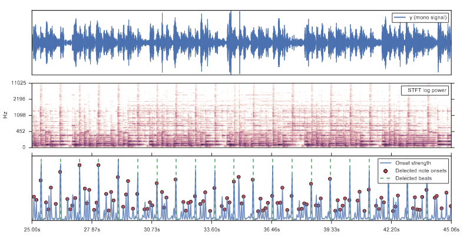
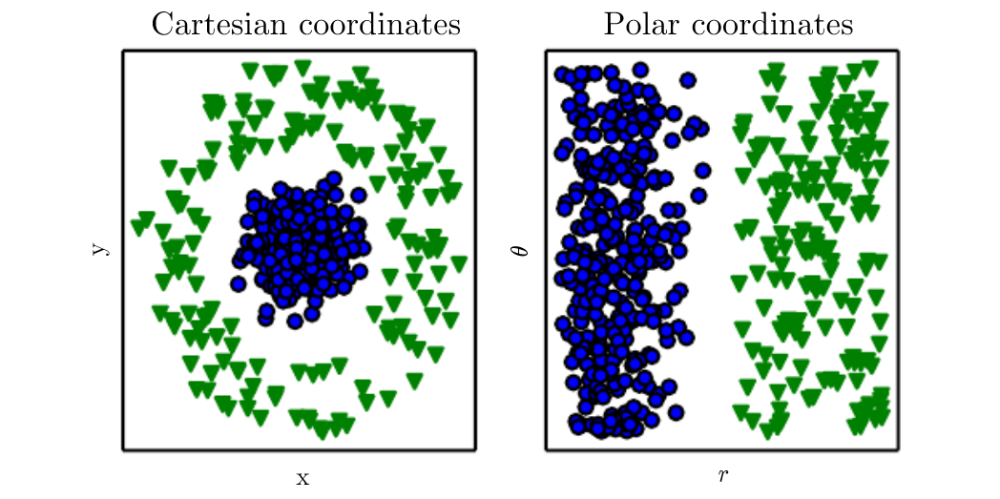
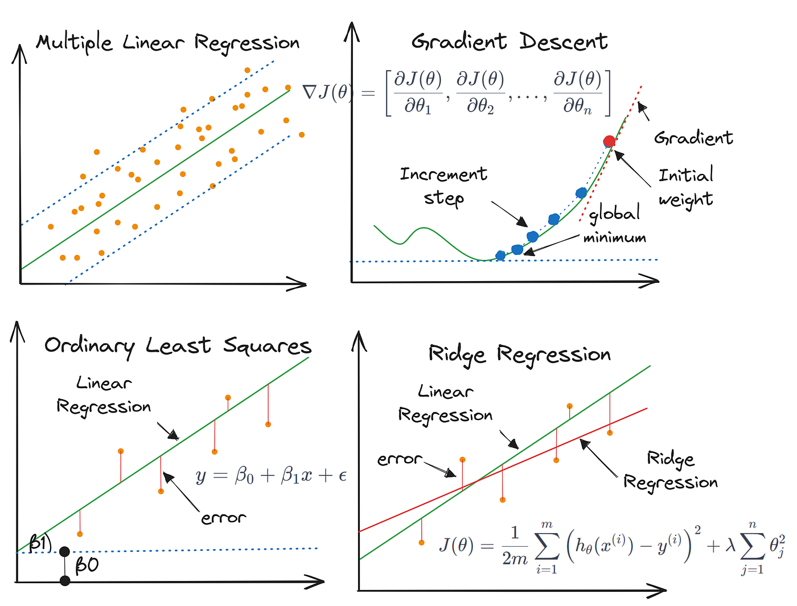
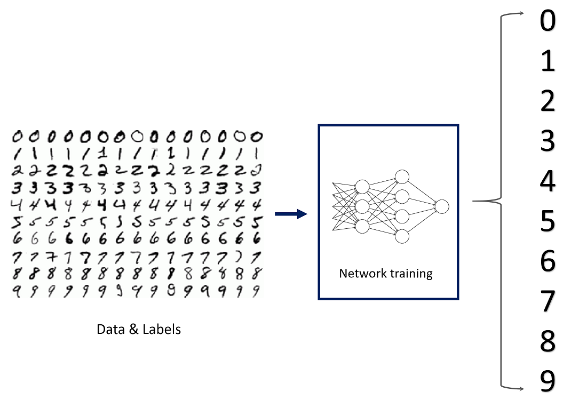
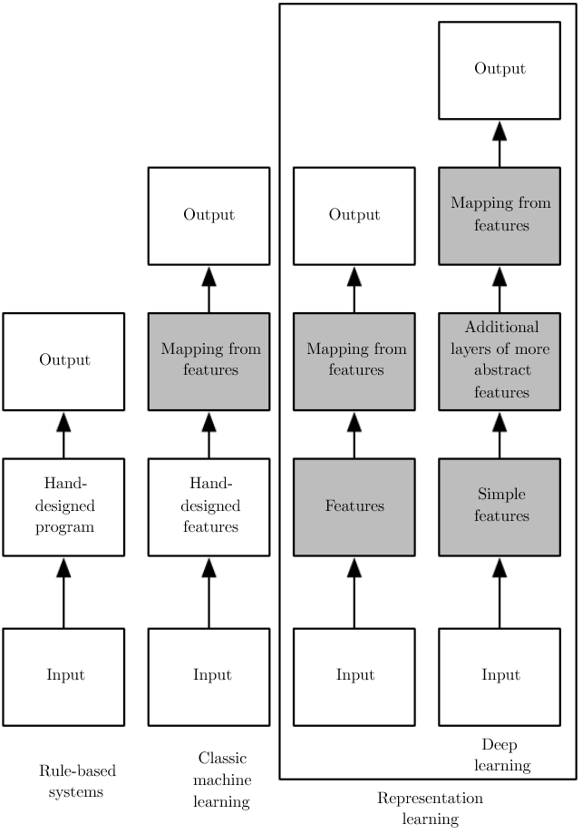
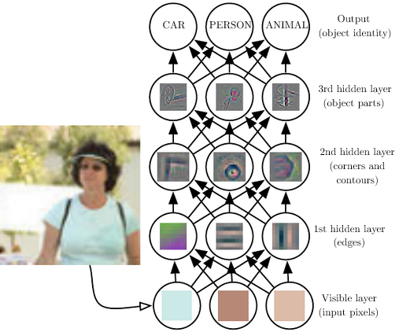
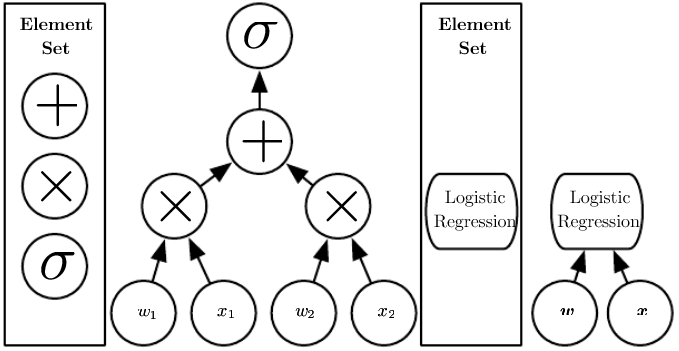

<!-- footer: <small><i style="font-size: 8pt;font-weight:500;color:black">AI in Computational Arts, Music, and Games </small></i> 
 
 -->
<!-- _color: black -->

# Sound, Machine Learning, and Deep Generative Models: A Practical Introduction

---

## Basics of Sound concepts

- Waveform: dynamics, transients, envelopes
- Frequency: pitch, overtones, timbre components
- Time–frequency transforms: spectrograms, mel spectrograms
- Energy and dynamics over time (envelope, loudness curves etc.)

<small>McFee, Brian, Colin Raffel, Dawen Liang, Daniel PW Ellis, Matt McVicar, Eric Battenberg, and Oriol Nieto. "librosa: Audio and music signal analysis in python." In Proceedings of the 14th python in science conference, pp. 18-25. 2015. </small>

---

### Waveforms and Their Features

- General Introduction:
https://www.audiolabs-erlangen.de/resources/MIR/FMP/C1/C1S3_Waveform.html
-Phase: https://images.contentful.com/piwi0eufbb2g/5HdnEvKEB7URTVKDH4iIhf/4ee0fc97b8ac2fe046c195bfc5484228/0_QFVha2lCgyhKjhuO.gif
- Dynamics and Loudness
https://www.audiolabs-erlangen.de/resources/MIR/FMP/C1/C1S3_Dynamics.html
- Envelope Calculation
https://www.audiolabs-erlangen.de/resources/MIR/FMP/C1/C1S3_Timbre.html
- Onset detection: 
https://www.audiolabs-erlangen.de/resources/MIR/FMP/C6/C6S1_OnsetDetection.html

---

## Timbre and its features

### FFT based
  - Fast Fourier Transform: https://pythonnumericalmethods.studentorg.berkeley.edu/notebooks/chapter24.04-FFT-in-Python.html
  - Short-time Fourier Transform: https://www.audiolabs-erlangen.de/resources/MIR/FMP/C2/C2_STFT-Basic.html
  - Time vs Frequency Resolution in FFTs: https://support.ircam.fr/docs/AudioSculpt/3.0/co/Window%20Size.html
  - Mel-frequency Cepstral Coefficients
    - Compute pipeline: https://www.researchgate.net/publication/257365356/figure/fig2/AS:297528441491462@1447947716655/Calculation-process-of-MFCC-coefficients.png
    - Example: https://librosa.org/doc/latest/generated/librosa.feature.mfcc.html

---

### Wavelet based Timbre Features

- Constant-Q Transform:
    https://librosa.org/doc/latest/generated/librosa.cqt.html
- Variable-Q Transform:
  https://librosa.org/doc/latest/generated/librosa.vqt.html

<small> [1] Schorkhuber C, Klapuri A (2010) Constant-Q Transform Toolbox
For Music Processing. In: Proceedings of the 7th Sound and Music Computing Conference (SMC 2010), p. 8. Barcelona, Spain 
</small>

---

# Music Specific Features
  Music specific
- Pitch:
  https://docs.pytorch.org/audio/stable/tutorials/audio_feature_extractions_tutorial.html#sphx-glr-tutorials-audio-feature-extractions-tutorial-py 
- Multipitch (chroma):
  - https://librosa.org/doc/latest/feature.html#spectral-features

- Beat detection: 
  - https://librosa.org/doc/latest/generated/librosa.beat.beat_track.html
---

## Machine Learning for Sound and Music Computing

---

### Importance of Feature Representations in Machine Learning

<small>I. Goodfellow, Y. Bengio, and A. Courville, Deep Learning. MIT Press, 2016.</small>

--- 

### Dimensionalty reduction

- Principle Component Analysis
https://musicinformationretrieval.com/content/10_decomposition/pca.html

- UMAP: Uniform Manifold Approximation and Projection: https://www.kaggle.com/code/adampq/umap-projections-little-shop-of-horrors-audio
  
- T-distributed stochastic neighbor embedding: https://ml4a.github.io/guides/AudioTSNEViewer/
  - Notes on t-SNE: https://dash.gallery/dash-tsne/
---

### Machine Learning 

- Supervised Learning 
- Unsupervised Learning

Detailed resources: https://www.ibm.com/think/machine-learning#605511093

---

### Supervised Learning - Regression

<small>Image source: https://python.plainenglish.io/understanding-multiple-linear-regression-in-machine-learning-58e981ce7747
</small>

---

### Supervised Learning - Regression for Interactive Audio

https://www.youtube.com/watch?v=dPV-gCqy9j4

<iframe width="560" height="315" src="https://www.youtube.com/embed/dPV-gCqy9j4?si=JqjBz-xwRA4RlOHQ" title="YouTube video player" frameborder="0" allow="accelerometer; autoplay; clipboard-write; encrypted-media; gyroscope; picture-in-picture; web-share" referrerpolicy="strict-origin-when-cross-origin" allowfullscreen></iframe>

---
### Supervised Learning - Classification

<small>Image source: https://medium.com/data-science/image-classification-in-10-minutes-with-mnist-dataset-54c35b77a38d 
</small>

---

### Supervised Learning - Audio Classification

Mediapipe: https://ai.google.dev/edge/mediapipe/solutions/audio/audio_classifier

---

### Unsupervised Learning - Clustering

https://colah.github.io/posts/2014-10-Visualizing-MNIST/

---

### Unsupervised Learning - Clustering for Audio

<iframe title="vimeo-player" src="https://player.vimeo.com/video/214256505?h=33d8c5be5e" width="640" height="360" frameborder="0" referrerpolicy="strict-origin-when-cross-origin" allow="autoplay; fullscreen; picture-in-picture; clipboard-write; encrypted-media; web-share"   allowfullscreen></iframe>

---

### Deep Learning

Two great books to go deeper:

- https://www.deeplearningbook.org/
- https://udlbook.github.io/udlbook/

---
<!-- _class: columns -->

 
 
 

--- 

### Deep Learning - Fun Visualizations

- https://adamharley.com/nn_vis/
- https://www.bulovic.at/cnn/

---

Distances

  For signals and features
    Eucledian 
    Cosine 
    Frechet Audio Distance
  For distributions
    KL-Divergence

---
DL based feature representations

  Deep Embeddings
  Autoencoders
  CLAP 

---

## Summary

- Features matter,
- Context specifies the machine learning approach,
- Various ML algorithms can be applied to a single case,
- Simple ML approaches are as applicable as more complex ones.

---